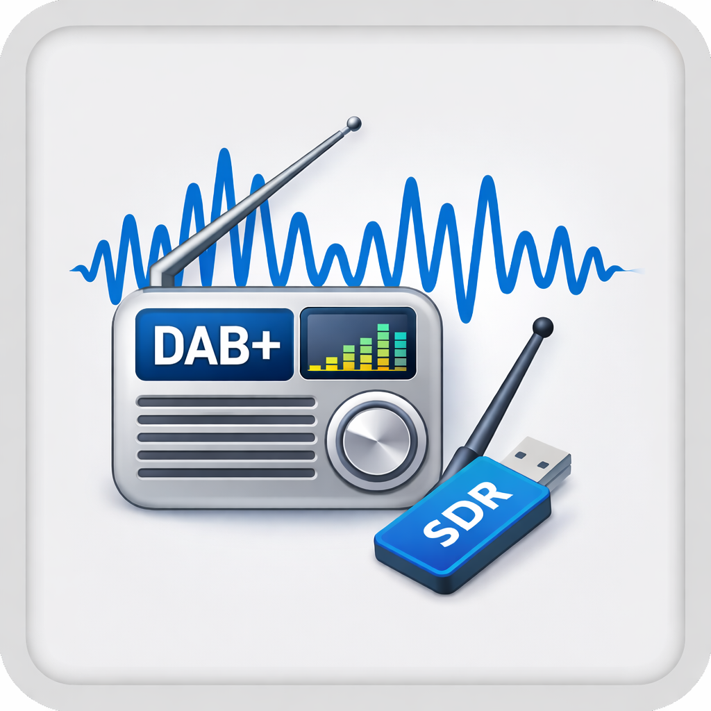

# Lyrion_DAB_Radio
Stream DAB+ radio to Lyrion Music Server via RTL-SDR

DAB+ radio reception via RTL-SDR for Lyrion Music Server (LMS).

Receives a full DAB multiplex using [welle-cli](https://github.com/AlbrechtL/welle.io), decodes all services simultaneously, streams each to a permanent Icecast mount with live metadata, and exposes an HTTP API for service discovery and MUX switching. An LMS plugin integrates it into the Radio menu as a flat station list.



---

## Architecture

```
RTL-SDR dongle
      ↓
  welle-cli -c 11C -Dw 9090   (decodes all services, serves MP3 over HTTP)
      ↓ http://localhost:9090/mp3/<SID>   (one stream per audio service)
  ffmpeg → Icecast /dab/dr-p1
  ffmpeg → Icecast /dab/dr-p2
  ffmpeg → Icecast /dab/dr-p3
  ...one ffmpeg per service...
      ↑
  dab-daemon  (HTTP API — service discovery, MUX switching, live metadata)
      ↑
  LMS Plugin  (Radio menu, flat station list)
```

**Service discovery:** welle-cli scans the MUX automatically. No manual SID or frequency configuration needed — all services are discovered at startup and cached.

**Live metadata:** the daemon polls welle-cli every 10 seconds for DLS (Dynamic Label Service) updates and pushes current song, genre, and description to each Icecast mount.

**Resilience:** a watchdog thread monitors ffmpeg processes and automatically restarts any that die.

---

## Prerequisites

- Linux server (Debian/Ubuntu recommended)
- RTL-SDR USB dongle connected and working
- [welle-cli](https://github.com/AlbrechtL/welle.io) built and installed (see note below)
- `ffmpeg` installed (`apt install ffmpeg`)
- Icecast2 server running (`apt install icecast2` or Docker)
- Lyrion Music Server 8.x or 9.x

### RTL-SDR USB dongle

RTL-SDR is a type of software-defined radio (SDR) that uses a cheap DVB-T TV tuner dongle as a wideband radio receiver. Originally designed for receiving digital TV, these dongles can be repurposed to receive a wide range of radio signals — including DAB+ — when used with the right software. A basic dongle from China costing around 10 EUR works perfectly fine for DAB reception.

> **Note:** Getting your RTL-SDR dongle working and building welle-cli is outside the scope of this guide. See the [rtl-sdr quickstart](https://www.rtl-sdr.com/rtl-sdr-quick-start-guide/) and the [welle.io README](https://github.com/AlbrechtL/welle.io) for instructions. Verify your setup works by running `welle-cli -c 11C -s any` before proceeding.

### Building welle-cli

```bash
sudo apt install cmake librtlsdr-dev libfftw3-dev libfaad-dev libmpg123-dev libmp3lame-dev
git clone https://github.com/AlbrechtL/welle.io
cd welle.io && mkdir build && cd build
cmake -DBUILD_WELLE_CLI=ON -DBUILD_GUI_APP=OFF ..
make -j$(nproc)
sudo cp src/welle-cli/welle-cli /usr/local/bin/
```

---

## Daemon Setup

The daemon (`dab-daemon.py`) manages welle-cli and ffmpeg pipelines, and exposes an HTTP API for service discovery and MUX switching.

### 1. Configure

Edit `daemon/dab-daemon.py` and fill in the configuration section at the top:

```python
WELLE_CLI_BIN      = "/usr/local/bin/welle-cli"
WELLE_PORT         = 9090              # internal welle-cli HTTP port (not exposed)

ICECAST_HOST       = "your-icecast-host"
ICECAST_PORT       = 8000
ICECAST_SOURCE     = "your-source-password"
ICECAST_ADMIN_USER = "admin"
ICECAST_ADMIN_PASS = "your-admin-password"

DAEMON_PORT        = 9980
```

And define your MUX list:

```python
MUX_LIST = [
    {
        "key":     "mux1",
        "name":    "DR MUX (11C)",
        "channel": "11C",
    },
]
```

Optionally create the service cache directory:

```bash
sudo mkdir -p /var/lib/dab-daemon
sudo chown $USER /var/lib/dab-daemon
```

### 2. Install

```bash
sudo cp daemon/dab-daemon.py /usr/local/bin/dab-daemon.py
sudo chmod +x /usr/local/bin/dab-daemon.py
```

### 3. Install as a systemd service

```bash
sudo cp daemon/dab-daemon.service /etc/systemd/system/
sudo systemctl daemon-reload
sudo systemctl enable dab-daemon
sudo systemctl start dab-daemon
```

Check that it is running:

```bash
sudo systemctl status dab-daemon
journalctl -u dab-daemon -f
```

### 4. Test the API

```bash
# Current status and active streams
curl http://localhost:9980/status

# List discovered MUXes and services
curl http://localhost:9980/muxes

# Switch to a different MUX
curl http://localhost:9980/switch/mux2

# Force rescan of current MUX
curl http://localhost:9980/rescan

# Stop everything
curl -X POST http://localhost:9980/stop
```

### API reference

| Method | Path | Description |
|--------|------|-------------|
| GET | `/status` | Current MUX, welle-cli state, and all active stream URLs |
| GET | `/muxes` | List all MUXes with discovered services and Icecast stream URLs |
| GET | `/switch/<key>` | Switch to MUX by key (async, ~15–30 s for discovery) |
| POST | `/switch?mux=<key>` | Switch to MUX by key |
| GET | `/rescan` | Force rescan of current MUX (clears cache) |
| POST | `/stop` | Stop all ffmpeg pipelines and welle-cli |

---

## LMS Plugin Installation

### Manual install

1. Copy the `LMSPlugin/DABRadio` folder into your LMS plugin directory:
   - Docker: `/config/cache/Plugins/DABRadio`
   - Standard: `/usr/share/squeezeboxserver/Plugins/DABRadio`

2. Restart LMS.

### Via external repository

Add the following URL in LMS under **Settings → Plugins → Add repository**:

```
https://raw.githubusercontent.com/macsatcom/Lyrion_DAB_Radio/main/repo.xml
```

After adding the repository, DAB Radio will appear in the plugin list and can be installed from there.

### Plugin configuration

After installation, go to **Settings → Plugins → DAB Radio → Settings** and configure:

- **Daemon URL** — URL to your dab-daemon, e.g. `http://192.168.1.10:9980`
- **Icecast Host** — hostname or IP of your Icecast server (leave blank to use URLs from daemon)
- **Icecast Port** — typically `8000`

The plugin will appear under **Radio → DAB Radio** in LMS as a flat list of all services on the active MUX.

---

## License

MIT
